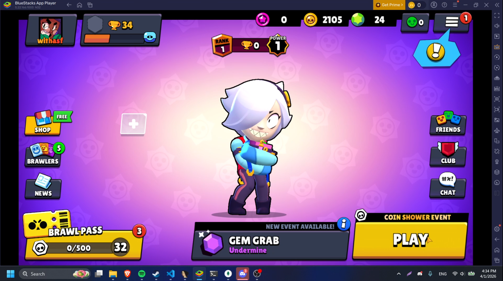
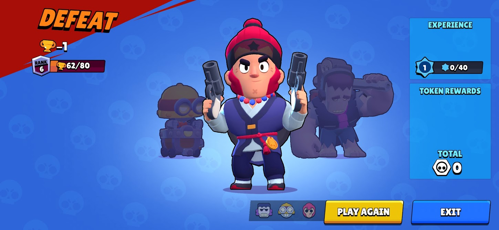
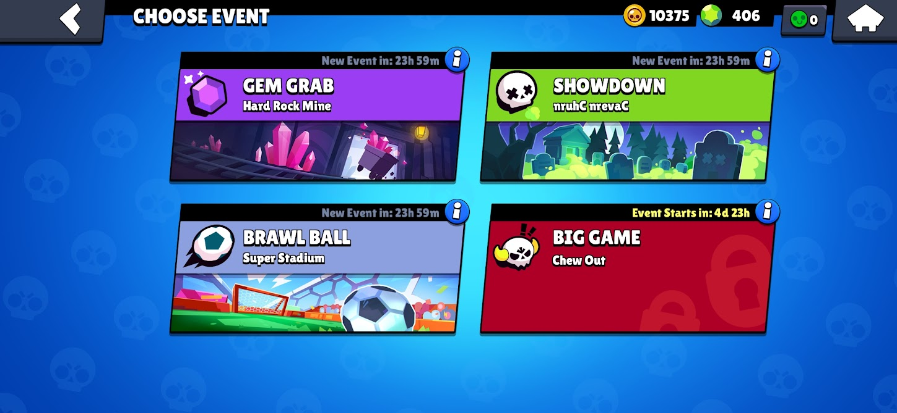
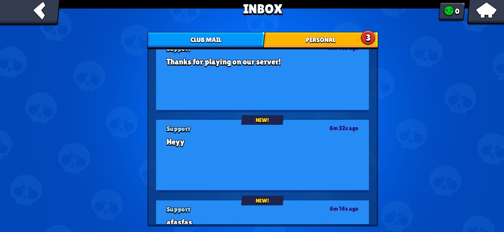
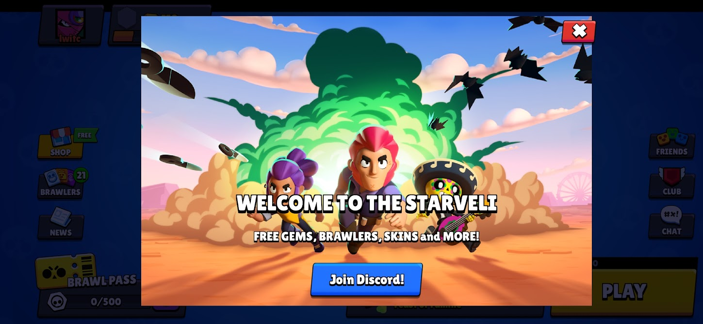

# Project Starveli (LunarBrawl)

Project Starveli (also known as LunarBrawl) is a custom **experimental** private server emulator for Brawl Stars v29.258, built entirely in Node.js. 

**Heads up:** This project is super experimental and basically a beta version. It's not fully ready, so I highly suggest you do NOT use this in production. I'm also totally done with this project. **I'm not going to update it again.** It is what it is.

Unlike some other servers that jammed everything into a single TCP connection, This Server uses a split architecture that correctly separates menu logic from real-time combat. It also features a lot of deep reverse engineering work on the game client to support custom UI hooking and native memory reads.

## What's Inside

The workspace is broken down into three main servers:

* **Lobby Server (TCP 9339)**
  Found in the `Lobby` folder, this handles everything outside of a match. Matchmaking, profile management, a Brawl Pass system, and database operations happen here. It also features an automatic shop and events system controlled via a web panel (`Lobby/Panel/server.js`). Honestly, I reused some code from my old 2022 servers, so some implementations like the automatic shop aren't optimal at all, but they work. It uses MongoDB to store player data. It also handles the Supercell Piranha protocol cryptography (NaCl and blake2b).

* **Battle Server (UDP 9338)**
  Found in the `Battle` folder, this handles the actual gameplay. It runs a dedicated UDP loop to process game ticks, vector math, entity tracking, and client inputs. The game logic relies on a custom CSV parser to read stats and map data directly from the game's original files. Keep in mind the battle server is super experimental and currently only walking works; I just did that to learn some things.

* **Asset Server (HTTP 2000)**
  Found in the `Asset Server` folder. This is a simple Express server that hosts files from the `custom_assets` folder, allowing for the client to access these. (Can be used for notifications)

## Under the Hood

* **Protocol**: Full implementation of the Piranha messaging protocol (ByteStreams, MessageFactory, Handshakes).
* **Game Data**: Uses the original game's CSV files (`csv_logic` and `csv_client`) so the server math exactly mirrors the client's math.
* **Client Modding**: We rely on reverse engineered memory structures to inject custom behaviors and read text inputs securely from the client. Note that the client mods (`liblwitchy.cpp` and `v29.258.js`) are only tested on Android Emulators, specifically BlueStacks 5. I also commented out a bunch of UI modifications in the client script to keep things more stable.

## Getting Started

⚠️ **Important: Game Assets are NOT included!**  
To avoid copyright strikes, all original game assets (like CSVs, sounds, and animations) have been ripped out. You will need to extract the `Assets` folder from the Brawl Stars v29.258 APK yourself and place them into the respective server folders (`Lobby/Assets`, `Battle/Assets`, etc.) before starting the servers!!

To get the servers up and running, you will need **Node.js** and **MongoDB** installed on your machine.

1. Make sure your MongoDB service is running in the background.
2. Open the `Lobby` folder, run `npm install` to grab dependencies, and launch it using `start_server.cmd` (or just run `node index.js`). The web panel will start automatically alongside it!
3. Open the `Battle` folder, run `npm install`, and launch the battle engine using `start_battle_server.cmd` (or `node index.js`).
4. If you are serving custom client files, open the `Asset Server` folder, install its dependencies, and run `node assets_server.js`.

That's the basic rundown. Poke around the code and have fun breaking things!

## Disclaimer

This server emulator is for educational purposes only. Using this with the official Brawl Stars client may violate the game's Terms of Service.

- This content is not affiliated with, endorsed, sponsored, or specifically approved by Supercell and Supercell is not responsible for it. For more information see <a href="https://supercell.com/en/fan-content-policy/">Supercell’s Fan Content Policy</a>

## Screenshots

  
  
  
  

