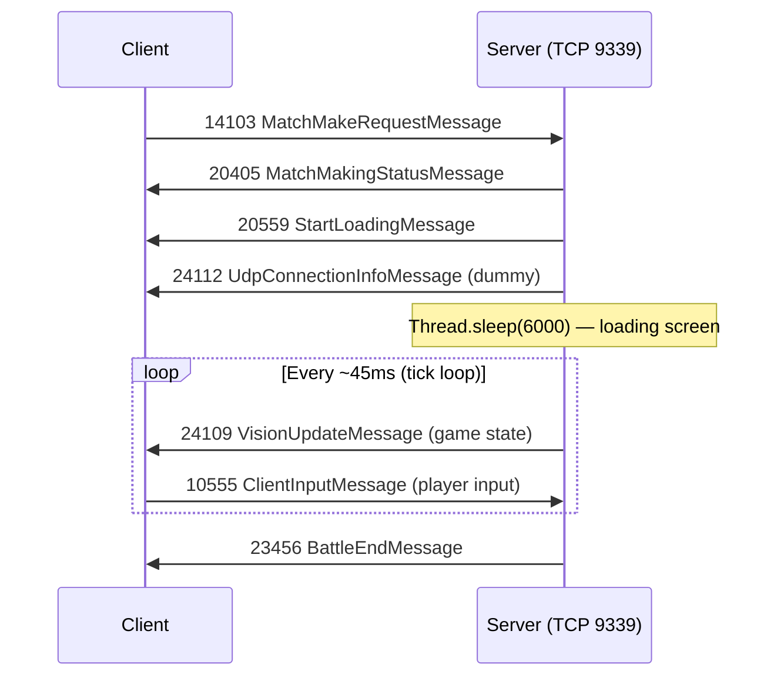

# Online Battle Analysis — Reference `javabrawlv29_server`

## Architecture Overview

The reference server is a **TCP-only** server. There is **no UDP server implementation**. All battle data (game state, player input) flows over the existing TCP connection on port `9339`.



---

## Full Battle Lifecycle

### 1. Matchmaking Request (`14103`)
- Client sends [MatchMakeRequestMessage](file:///c:/Users/lwitchy/Desktop/Starveli/Reference/javabrawlv29_server/src/DemirCnq/Messaging/Client/MatchMakeRequestMessage.java) with the selected brawler index
- Server validates, then immediately sends [MatchMakingStatusMessage](file:///c:/Users/lwitchy/Desktop/Starveli/Reference/javabrawlv29_server/src/DemirCnq/Messaging/Server/MatchMakingStatusMessage.java#10-35) (timer=50, found=1, max=1)
- Starts a new [Matchmaking](file:///c:/Users/lwitchy/Desktop/Starveli/Reference/javabrawlv29_server/src/DemirCnq/Logic/Battle/Matchmaking.java#17-71) instance on a **separate thread**

### 2. Battle Start Phase
In [Matchmaking.StartBattle()](file:///c:/Users/lwitchy/Desktop/Starveli/Reference/javabrawlv29_server/src/DemirCnq/Logic/Battle/Matchmaking.java#L37-L54):

| Step | Message ID | Message | Purpose |
|------|-----------|---------|---------|
| 1 | `20559` | [StartLoadingMessage](file:///c:/Users/lwitchy/Desktop/Starveli/Reference/javabrawlv29_server/src/DemirCnq/Messaging/Server/StartLoadingMessage.java#13-89) | Sends map, player list, brawler/skin data, game mode config |
| 2 | `24112` | [UdpConnectionInfoMessage](file:///c:/Users/lwitchy/Desktop/Starveli/Reference/javabrawlv29_server/src/DemirCnq/Messaging/Server/UdpConnectionInfoMessage.java#9-31) | **Dummy** — sends hardcoded `192.168.1.103:9339`. Client expects this but data still flows over TCP |
| 3 | — | `Thread.sleep(6000)` | Waits for client to finish loading screen |

### 3. Game Loop (Tick-Based Simulation)
```
while (player.roundstate == -1 && started) {
    tick++;
    process(player);       // encode state → send VisionUpdate
    Thread.sleep(45);      // ~22 ticks/second
}
```

Each tick:
1. Creates a new `BitStream(1024)`
2. `LogicGameObjectManagerServer.encode(0)` — writes full game state into BitStream
3. `LogicGameObjectManagerServer.update()` — checks win condition (tick ≥ 1000 → win + send BattleEnd)
4. `VisionUpdateMessage.encode()` — wraps BitStream into a TCP message and sends it

### 4. Client Input (`10555`)
[ClientInputMessage](file:///c:/Users/lwitchy/Desktop/Starveli/Reference/javabrawlv29_server/src/DemirCnq/Messaging/Client/ClientInputMessage.java) arrives on the **same TCP connection** and is decoded via `BitStream`:

| Field | Bits | Purpose |
|-------|------|---------|
| Header fields | 14+10+13+10+10 | Timing/sequence data |
| Input count | 5 | Number of inputs in batch |
| Per-input: handled input | 15 | Input sequence number |
| Per-input: action id | 4 | `2`=move, `9`=pin |
| Per-input: x, y | 15+15 | Position (signed) |
| Per-input: pin data | 3 | Pin index (if action=9) |

### 5. VisionUpdate (`24109`)
[VisionUpdateMessage](file:///c:/Users/lwitchy/Desktop/Starveli/Reference/javabrawlv29_server/src/DemirCnq/Messaging/Server/VisionUpdateMessage.java) structure:

| Field | Encoding | Purpose |
|-------|----------|---------|
| TicksGone | VInt | Current server tick |
| HandledInput | VInt | Last processed client input |
| Unknown | VInt | Always 0 |
| TicksGone (repeat) | VInt | Duplicate for sync |
| HasVisionData | Boolean | Always true |
| VisionBitStream | Raw bytes | Full game object state from `BitStream` |

### 6. Game State Encoding (BitStream)
[LogicGameObjectManagerServer.encode()](file:///c:/Users/lwitchy/Desktop/Starveli/Reference/javabrawlv29_server/src/DemirCnq/Logic/Battle/LogicGameObjectManagerServer.java#L35-L148) writes:
- Player ID, round state (-1=playing, 0=lost, 1=win, 2=draw)
- Pin usage (emoji), score/stats fields
- **Game objects** (count, type=16 for character, x/y position)
- HP, max HP, items collected
- Attack state, control state, visibility
- Charge/special ability state

### 7. Battle End (`23456`)
[BattleEndMessage](file:///c:/Users/lwitchy/Desktop/Starveli/Reference/javabrawlv29_server/src/DemirCnq/Messaging/Server/BattleEndMessage.java) — triggered when `tick >= 1000`. Sends result, trophies, tokens, and player display data.

---

## Do We Need a Separate UDP Server?

> [!IMPORTANT]
> **Short answer: No — not for the initial implementation.**

The reference server **does not implement any UDP**. Here's why and what to consider:

### What [UdpConnectionInfoMessage](file:///c:/Users/lwitchy/Desktop/Starveli/Reference/javabrawlv29_server/src/DemirCnq/Messaging/Server/UdpConnectionInfoMessage.java#9-31) Actually Does
It's a **stub** that sends hardcoded values. The client receives it as part of the battle-start handshake, but all actual game data continues over TCP. The message exists because the **original Supercell server** uses UDP for real-time battle data, but this reference server bypasses it entirely.

### TCP-Only Approach (What the Reference Does)
| Pros | Cons |
|------|------|
| Much simpler to implement | Higher latency (~50-100ms vs ~5-20ms) |
| Reliable delivery, no packet loss handling | Head-of-line blocking |
| Works with the existing server infrastructure | May feel sluggish with 10 players |
| Battle state is small enough for TCP | TCP congestion control can cause spikes |

### When You Would Need UDP (Future Optimization)
| Scenario | Recommendation |
|----------|---------------|
| Solo/practice battles | TCP is fine |
| 1v1 or small matches | TCP is fine |
| 3v3 with real players | TCP works but UDP would improve feel |
| 10-player showdown | UDP strongly recommended |
| Spectator mode with many viewers | UDP for spectator stream |

### If You Later Want UDP
You would need a separate UDP socket server running alongside TCP. The battle loop would send [VisionUpdateMessage](file:///c:/Users/lwitchy/Desktop/Starveli/Reference/javabrawlv29_server/src/DemirCnq/Messaging/Server/VisionUpdateMessage.java#11-41) payloads over UDP datagrams instead of TCP frames. The [UdpConnectionInfoMessage](file:///c:/Users/lwitchy/Desktop/Starveli/Reference/javabrawlv29_server/src/DemirCnq/Messaging/Server/UdpConnectionInfoMessage.java#9-31) would then contain the **real** UDP server address/port for the client to connect to.

---

## Key Message IDs Summary

| ID | Direction | Name | Phase |
|----|-----------|------|-------|
| `14103` | Client→Server | MatchMakeRequest | Matchmaking |
| `14106` | Client→Server | CancelMatchmaking | Matchmaking |
| `20405` | Server→Client | MatchMakingStatus | Matchmaking |
| `20559` | Server→Client | StartLoading | Battle Start |
| `24112` | Server→Client | UdpConnectionInfo | Battle Start |
| `10555` | Client→Server | ClientInput | In-Battle |
| `24109` | Server→Client | VisionUpdate | In-Battle |
| `23456` | Server→Client | BattleEnd | Battle End |

---

## Key Takeaways for Our Implementation

1. **Start with TCP-only** — mirror the reference approach, send [VisionUpdate](file:///c:/Users/lwitchy/Desktop/Starveli/Reference/javabrawlv29_server/src/DemirCnq/Messaging/Server/VisionUpdateMessage.java#11-41) over the existing TCP connection
2. **Send a dummy [UdpConnectionInfoMessage](file:///c:/Users/lwitchy/Desktop/Starveli/Reference/javabrawlv29_server/src/DemirCnq/Messaging/Server/UdpConnectionInfoMessage.java#9-31)** — the client expects it; use your server's IP + port 9339
3. **Implement the tick loop** at ~45ms intervals on a separate thread per battle
4. **Use `BitStream`** for encoding game objects — this is a bit-level serializer for compact game state
5. **Handle [ClientInputMessage](file:///c:/Users/lwitchy/Desktop/Starveli/Reference/javabrawlv29_server/src/DemirCnq/Messaging/Client/ClientInputMessage.java#10-56) (10555)** on the TCP message handler — decode movement + actions via `BitStream`
6. **Battle ends** when a win/loss condition is met — send [BattleEndMessage](file:///c:/Users/lwitchy/Desktop/Starveli/Reference/javabrawlv29_server/src/DemirCnq/Messaging/Server/BattleEndMessage.java#10-101) and stop the tick loop
