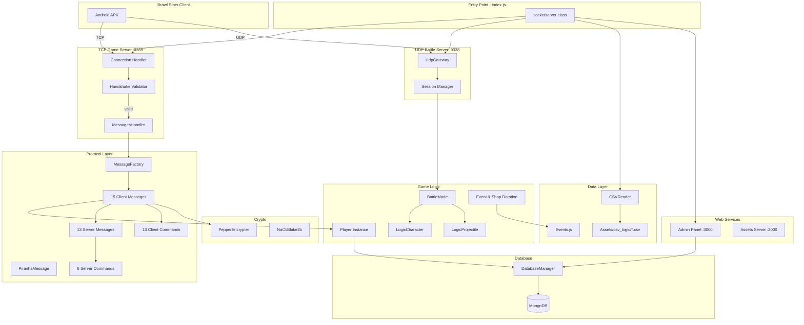
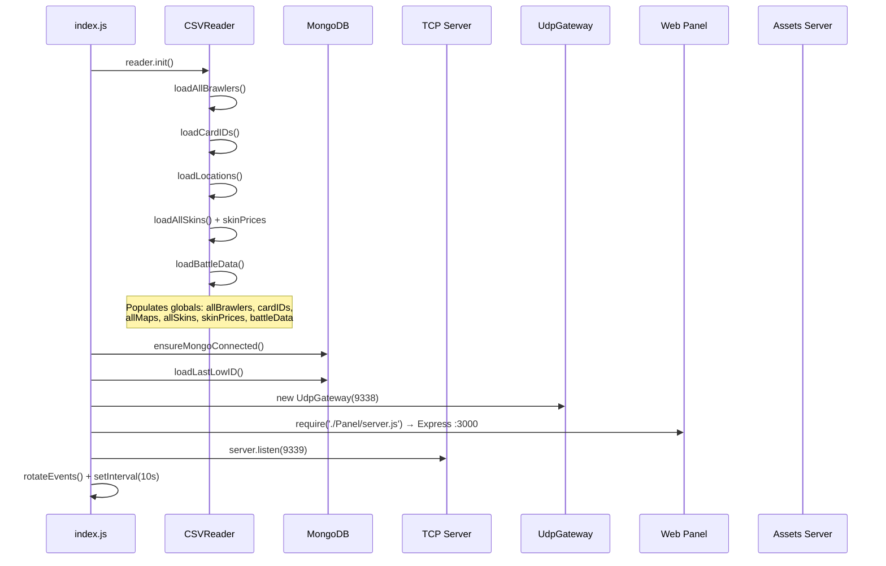
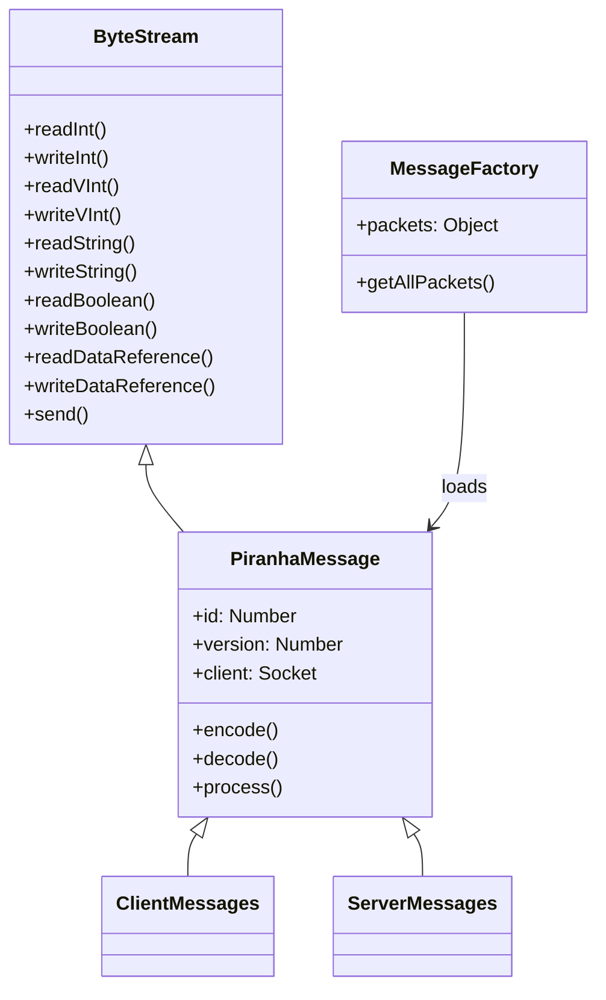
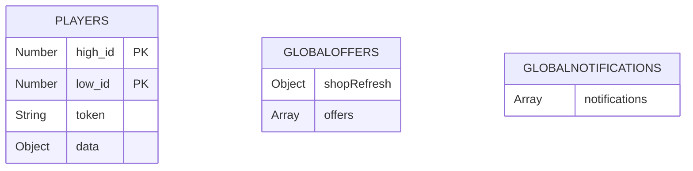
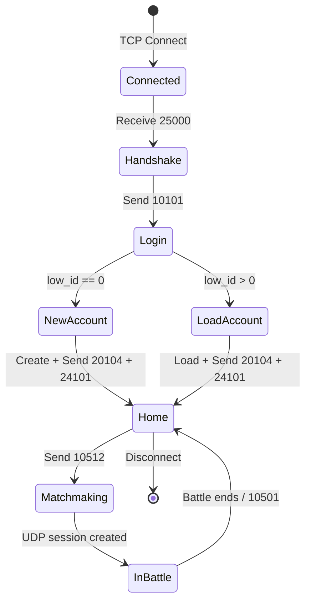
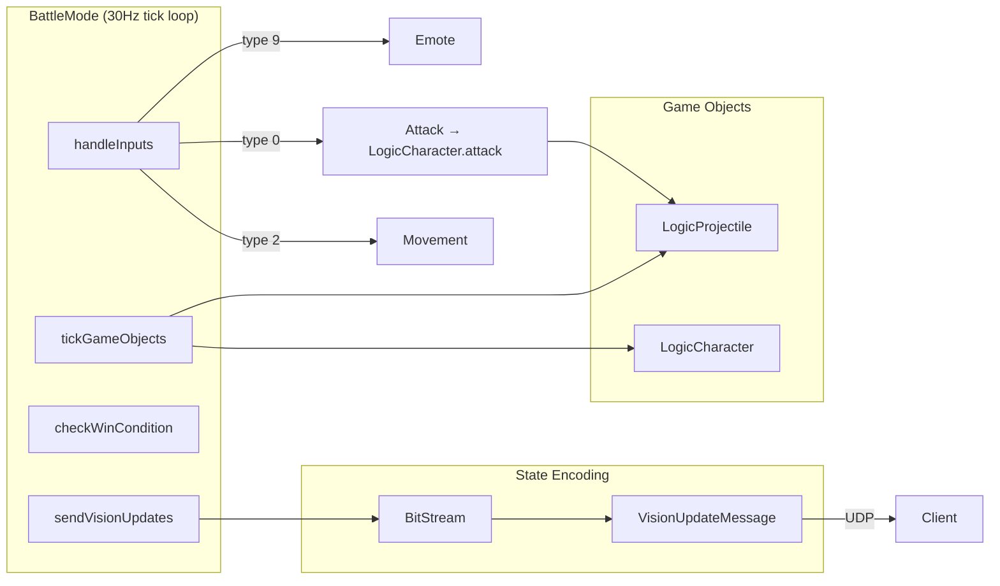
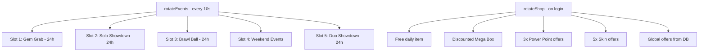
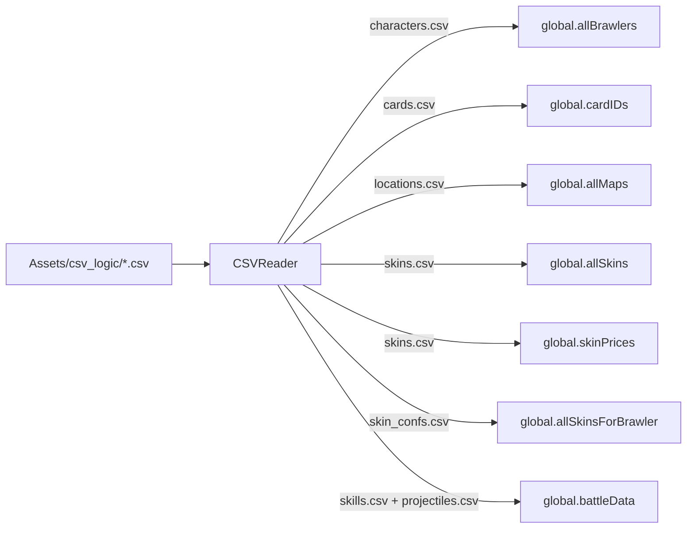
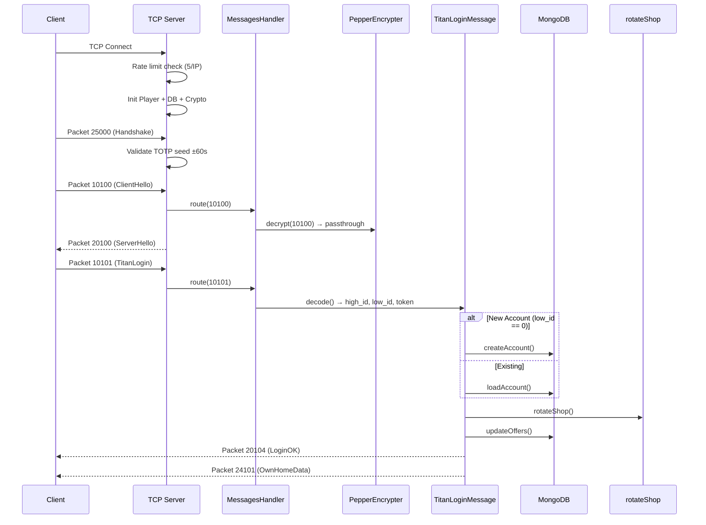

# Starveli Server — Architecture Report

**Project**: LunarBrawl (Brawl Stars Private Server)
**Language**: Node.js (JavaScript)
**Entry Point**: [index.js](file:///c:/Users/lwitchy/Desktop/Starveli/index.js)

---

## High-Level Architecture



---

## Server Boot Sequence



---

## Module Breakdown

### 1. Entry Point — [index.js](file:///c:/Users/lwitchy/Desktop/Starveli/index.js)

| Responsibility | Details |
|---|---|
| TCP Server | `net.Server` on port **9339** |
| Initialization | CSV loading → MongoDB → UDP gateway → Web Panel |
| Connection limits | Max **5** connections/IP |
| Packet framing | 7-byte header: `[id:2][len:3][version:2]` |
| Anti-bot | Time-based handshake ([(seed ^ 0x53544152) + 0x1337](file:///c:/Users/lwitchy/Desktop/Starveli/index.js#85-88)) with ±60s window |
| Buffer overflow guard | Max 512KB per client buffer |
| Session timeout | Configurable (dev: 20s, prod: 15s) |

### 2. Networking

| File | Purpose |
|---|---|
| [MessagesHandler.js](file:///c:/Users/lwitchy/Desktop/Starveli/Networking/MessagesHandler.js) | Routes packet IDs → handler classes, calls [decode()](file:///c:/Users/lwitchy/Desktop/Starveli/Protocol/Messages/Client/TitanLoginMessage.js#18-28) then [process()](file:///c:/Users/lwitchy/Desktop/Starveli/Protocol/PiranhaMessage.js#22-25) |
| [Queue.js](file:///c:/Users/lwitchy/Desktop/Starveli/Networking/Queue.js) | Packet assembly buffer with merged-packet detection (legacy, partially used) |
| [UdpGateway.js](file:///c:/Users/lwitchy/Desktop/Starveli/Networking/UdpGateway.js) | UDP socket on **9338**, session binding, routes `ClientInputMessage` (type 10555) to [BattleMode](file:///c:/Users/lwitchy/Desktop/Starveli/Logic/Instances/BattleMode.js#8-378) |

### 3. Protocol



#### Client Messages (ID < 20000)
| ID | File | Purpose |
|---|---|---|
| 10100 | ClientHelloMessage | Initial hello (unencrypted) |
| 10101 | TitanLoginMessage | **Main login** — auth, account creation, shop rotation |
| 10107 | ClientCapabilities | Device capability report |
| 10108 | KeepAliveMessage | Heartbeat / keeps session alive |
| 10112 | ChangeAvatarNameMessage | Name change request |
| 10113 | AvatarNameCheckRequestMessage | Name availability check |
| 10212 | GetPlayerProfileMessage | View another player's profile |
| 10501 | AskForBattleEndMessage | Request to end/leave battle |
| 10504 | BattleStartedHome | Confirms client loaded battle |
| 10512 | MatchMakeRequestMessage | Start matchmaking → creates BattleMode |
| 10555 | ClientInputMessage | **UDP battle input** (movement, attack, emote) |
| 14102 | EndClientTurnMessage | **Game commands** — purchases, upgrades, etc. |
| 14109 | GoHomeFromOfflinePractise | Return to lobby |
| 14110 | PlayerStatusMessage | Player status report |
| 14366 | AnalyticsEventMessage | Client analytics |

#### Server Messages (ID ≥ 20000)
| ID | File | Purpose |
|---|---|---|
| 20100 | ServerHelloMessage | Server hello response |
| 20103 | LoginFailedMessage | Login rejection |
| 20104 | TitanLoginOkMessage | Login success with player IDs/token |
| 20107 | LobbyInfoMessage | Lobby state |
| 20113 | AvatarNameCheckResponseMessage | Name check result |
| 20212 | PlayerProfileMessage | Profile data response |
| 24101 | OwnHomeDataMessage | **Full home state** (brawlers, shop, quests, pass) |
| 24109 | VisionUpdateMessage | **Battle state** (sent via UDP) |
| 24111 | StartLoadingMessage | Battle loading screen trigger |
| 24115 | UdpConnectionInfoMessage | UDP session info for client |
| 24116 | MatchMakingStatusMessage | Matchmaking progress |
| 24124 | BattleEndMessage | Battle results |
| 24111 | AvailableServerCommandMessage | Push server commands to client |

#### Client Commands (via EndClientTurnMessage)
| Command | Purpose |
|---|---|
| LogicSelectBrawlerCommand | Switch active brawler |
| LogicSelectSkinCommand | Equip skin |
| LogicLevelUpCommand | Power up brawler |
| LogicGatchaCommand | Open loot box |
| LogicPurchaseOfferCommand | Buy shop offer |
| LogicPurchaseBrawlPass | Buy Brawl Pass |
| LogicPurchaseBrawlpassProgressCommand | Buy pass tier |
| LogicClaimRankUpRewardCommand | Claim rank reward |
| LogicClaimTailRewardCommand | Claim trophy road reward |
| LogicClearShopTickCommand | Mark offer as seen |
| LogicSetPlayerThumbnailCommand | Change player icon |
| LogicSetPlayerNameColorCommand | Change name color |
| LogicViewInboxNotificationCommand | Mark notification read |

#### Server Commands (pushed to client)
| Command | Purpose |
|---|---|
| LogicAddNotificationCommand (206) | Push inbox notification |
| LogicChangeAvatarNameCommand | Confirm name change |
| LogicDayChangedCommand | Day-change trigger |
| LogicOffersChangedCommand (211) | Refresh shop offers |
| LogicGiveDeliveryCommand | Grant items/rewards |
| LogicBuyPinPacks | Pin pack purchase result |

### 4. Database — MongoDB



Key operations: [createAccount()](file:///c:/Users/lwitchy/Desktop/Starveli/Database/databasemanager.js#100-158), [loadAccount()](file:///c:/Users/lwitchy/Desktop/Starveli/Database/databasemanager.js#179-193), [updateAccountData()](file:///c:/Users/lwitchy/Desktop/Starveli/Database/databasemanager.js#159-178), [updateAllAccounts()](file:///c:/Users/lwitchy/Desktop/Starveli/Database/databasemanager.js#194-218), [loadLastLowID()](file:///c:/Users/lwitchy/Desktop/Starveli/Database/databasemanager.js#219-236), [getGlobalOffers()](file:///c:/Users/lwitchy/Desktop/Starveli/Database/databasemanager.js#55-72), [updateGlobalOffers()](file:///c:/Users/lwitchy/Desktop/Starveli/Database/databasemanager.js#73-82), [getGlobalNotifications()](file:///c:/Users/lwitchy/Desktop/Starveli/Database/databasemanager.js#83-90).

### 5. Game Logic

#### Player Lifecycle



#### Battle System



- **Tick rate**: 30Hz (33ms intervals)
- **Movement**: Absolute coordinates, speed 30 units/tick toward target
- **Attacks**: Burst firing with ammo system (1000 units/bar), fan spread or parallel bullets
- **Projectiles**: 4 substeps/tick, collision at ≤222 units, removed after `castingTime` ticks
- **Input deduplication**: Tracks `lastHandledInput` index to ignore UDP retransmissions

### 6. Shop & Event Rotation



### 7. Crypto — Pepper Encryption

| Phase | Message | Action |
|---|---|---|
| Client Hello | 10100 | Passthrough (unencrypted) |
| Login | 10101 | NaCl box_open with derived shared key |
| Server Hello | 20100 | Passthrough, stores session token |
| Login OK | 20104/20103 | NaCl box with nonce + new session key |
| Subsequent | All others | NaCl box with incrementing nonce |

### 8. Web Panel — Express :3000

| Endpoint | Method | Auth | Purpose |
|---|---|---|---|
| `/api/csvdata` | GET | No | Brawler/skin/shop CSV data |
| `/api/globaloffers` | GET | No | View current offers |
| `/api/globaloffers` | POST | Yes | Create/update offers → broadcast to clients |
| `/api/globaloffers` | DELETE | Yes | Clear all offers |
| `/api/config` | GET | Yes | Shop timing config |
| `/api/analytics` | GET | Yes | Total + online player counts |
| `/api/players` | GET | Yes | Search/list players |
| `/api/players/:low_id` | POST | Yes | Edit player resources (live update) |
| `/api/notifications/personal` | POST | Yes | Send notification to one player |
| `/api/notifications/global` | POST | Yes | Broadcast notification to all |

### 9. Assets Server — Express :2000

Serves static files from `custom_assets/` directory with CORS. Generates SHA-1 hashes on startup for asset verification.

### 10. CSV Data Pipeline



---

## Request Flow — Full Login



---

## Global State

The server relies heavily on `global.*` for shared state:

| Global | Set By | Purpose |
|---|---|---|
| `global.allBrawlers` | CSVReader | Array of brawler indices |
| `global.cardIDs` | CSVReader | Brawler → card ID mapping |
| `global.allMaps` | CSVReader | Map pools by game mode |
| `global.allSkins` | CSVReader | All non-default skin indices |
| `global.skinPrices` | CSVReader | Skin cost/currency lookup |
| `global.allSkinsForBrawler` | CSVReader | Brawler → available skins |
| `global.battleData` | CSVReader | Per-brawler attack stats |
| `global.lastLowID` | DatabaseManager | Auto-increment player ID counter |
| `global.connectionCount` | index.js | Online player count |
| `global.clients` | index.js | Array of connected TCP sockets |
| `global.udpGateway` | index.js | UDP battle server instance |

---

## Dependencies

| Package | Version | Purpose |
|---|---|---|
| mongoose | ^7.6.7 | MongoDB ODM |
| express | ^5.2.1 | Web Panel + Assets Server |
| body-parser | ^2.2.2 | JSON request parsing |
| cors | ^2.8.6 | Cross-origin requests |
| csv | ^6.3.1 | CSV file parsing |
| glob | ^7.2.0 | File pattern matching |
| luxon | ^3.4.4 | Date/time calculations |
| minimist | ^1.2.8 | CLI argument parsing |
| extend | ^3.0.2 | Config merging |
| crypto | built-in | Hashing, NaCl keys |

---

## File Tree (excluding Reference/)

```
Starveli/
├── index.js                          # Entry point — TCP server
├── config.js                         # Environment config (dev/prod)
├── assets_server.js                  # Static asset server :2000
├── Helpers.js                        # Date/time utilities
├── LogicBoxData.js                   # Loot box drop tables
├── updateDatabase.js                 # DB migration script
│
├── Networking/
│   ├── MessagesHandler.js            # Packet router
│   ├── Queue.js                      # Packet assembly
│   └── UdpGateway.js                 # UDP battle transport
│
├── Protocol/
│   ├── MessageFactory.js             # Auto-loads client handlers
│   ├── PiranhaMessage.js             # Base message class
│   ├── Messages/Client/              # 15 client message handlers
│   ├── Messages/Server/              # 13 server message encoders
│   ├── Commands/Client/              # 13 game command processors
│   └── Commands/Server/              # 6 server-push commands
│
├── Logic/
│   ├── Instances/Player.js           # Player data model
│   ├── Instances/BattleMode.js       # Real-time battle simulation
│   ├── Battle/LogicCharacter.js      # Brawler combat logic
│   ├── Battle/LogicProjectile.js     # Projectile physics
│   ├── Battle/LogicBox.js            # In-battle box entity
│   ├── Rotation.js                   # Event/shop rotation engine
│   ├── LogicMath.js                  # Trig lookup tables
│   ├── LogicVector2.js               # 2D vector math
│   └── LogicBoxData.js               # Box reward calculations
│
├── ByteStream/
│   ├── index.js                      # Main binary serializer
│   ├── ByteArray.js                  # Hex utils
│   ├── LogicLong.js                  # 64-bit int support
│   └── BitStream/                    # Bit-level serialization (battle)
│
├── Crypto/
│   ├── PepperEncrypter.js            # NaCl encrypt/decrypt
│   ├── Nacl.js                       # TweetNaCl implementation
│   ├── Nonce.js                      # Nonce management
│   ├── blake2b.js                    # Blake2b hash
│   └── util.js                       # Crypto utilities
│
├── CSVReader/
│   ├── reader.js                     # CSV data loader
│   └── CSVParse.js                   # Low-level CSV parser
│
├── Database/
│   └── databasemanager.js            # Mongoose models + CRUD
│
├── Data/
│   ├── Events.js                     # Event slot definitions
│   └── globaloffers.json             # Default offer seed
│
├── Panel/
│   ├── server.js                     # Express admin API
│   └── public/                       # Dashboard frontend
│
└── Assets/                           # Game CSV data files
    ├── csv_logic/                    # characters, skins, skills, etc.
    └── csv_client/                   # shop_items, etc.
```
